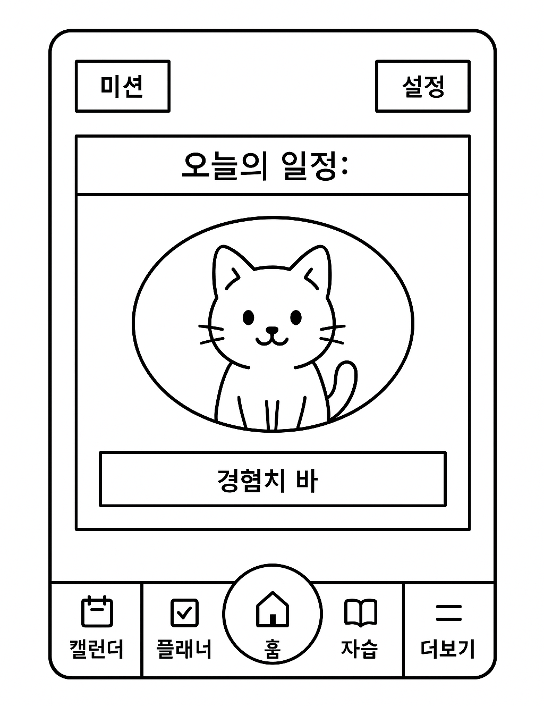

# 🐾 Campus Cat - 동기부여형 학교 생활 도우미 앱

> **"귀여운 고양이와 함께하는 자기주도 학습 생활과 출석 체크를 동시에 해결해주는 앱!"**

Campus Cat은 학교 생활에 필요한 다양한 기능들을 통합한 **동기부여 기반 모바일 앱**입니다.  
학생들이 자신의 일정을 체계적으로 관리하고, 고양이 육성 보상 시스템을 통해 **재미있게 학습과 일상을 관리**할 수 있도록 돕습니다.
---

## 📱 주요 기능

- **GPS를 이용한 자동 출석 시스템​**
- **자습 및 플래너를 이용한 자율 주도 학습 시스템** 
- **미션 또는 퀘스트를 이용한 고양이 육성 시스템​**: 
---

## 🛠️ 사용 기술

- **Android Studio (Java)**
- **XML 레이아웃**
- **Fragment / BottomNavigationView 사용**
- **ProgressBar를 활용한 XP 시스템**
---

## 📸 초기 홈화면 

## 📌 프로젝트 개요

- **프로젝트명:** Campus Cat  
- **목표:** 학생의 자기주도적인 학습 및 생활 습관 형성을 위한 보상형 모바일 앱 제작  
- **형태:** Android 기반 모바일 애플리케이션

---

## 💡 기획 의도 및 필요성

### 🔍 필요성
- 학생들의 낮은 학교생활 참여도 및 동기 저하
- 모바일 친화적 학습 트렌드 확산
- 스마트폰을 기반으로 한 일정/과제/자습 관리 수요 증가

### 🎯 프로젝트 목적
- 고양이 육성 보상 시스템과 연동된 학습 및 생활 관리 제공
- 동기부여 요소를 접목한 자율적 학교생활 유도

### 🌱 기대 효과
- 학업 참여도 증가
- 자기주도적 생활 습관 형성
- 생활 전반의 모바일 최적화

---

## 🛠 사용 기술 스택

- Android Studio (Java)
- XML Layout Design
- SharedPreferences (로컬 저장)
- Firebase (선택적으로 확장 가능)
- GitHub (버전 관리 및 협업)

---
메인 홈화면 및 로고 이미지

## 🚀 주요 기능

### 📅 캘린더
- 날짜 클릭 → 일정 추가 가능
- 오늘 일정이 있을 경우 `"오늘은 OO이 있는 날이에요!"` 출력
- 일정 없을 경우 `"오늘은 한가로운 날이에요!"` 출력

### 🕒 시간표
- 초기 상태: `"시간표가 없습니다"` 표시
- 팝업창 입력을 통한 시간표 등록
- TableLayout 기반 시간표 시각화 + 카드뷰 목록
- 삭제 기능 포함

### 📝 자습 플래너
- 과목명 + 목표 시간 설정
- 자습 시간 추적 → 성취도 및 경험치 증가
- 하루 1회만 작성 가능 (다음날까지 수정 불가)

### 🍱 학식
- 캘린더 선택 시 해당 날짜 학식 정보 출력
- 학식 정보 없을 경우 `"학식 정보가 없습니다"` 출력

### 🐱 고양이 육성 시스템
- 고양이 레벨, 경험치 표시
- 인벤토리: 재화로 아이템 구매 / 설치 / 철거 가능
- 미니게임: 물고기 재화 획득
- 놀아주기: 발바닥 10개 클릭 시 경험치 +10

### 🏠 홈 화면
- 상단: 미션 / 설정 이동 버튼
- 중앙: 오늘 일정 요약 + 고양이 레이아웃 이동
- 하단: 고정 내비게이션 바

---

## 👨‍👩‍👧‍👦 팀원 및 담당 역할

| 이름     | 담당 기능 |
|----------|-----------|
| **이원겸**   | 홈 화면(일부), 고양이 화면(인벤토리, 미니게임, 놀아주기) |
| **이은우**   | 시간표, 캘린더 기능, 오류 수정, 앱 전체 연동 |
| **임석준**   | 자습 플래너, 학식 기능, 앱 통합 코드 수정 |
| **이주한**   | 설정 기능(화면 밝기, 초기화), 더보기 메뉴 |

---

## 🔗 프로젝트 링크

- GitHub Repository:  
  👉 [https://github.com/zeta078/CampusCat](https://github.com/zeta078/CampusCat)
  
---

## 🙏 감사합니다!

함께 귀여운 고양이를 키우며 즐거운 학교생활을 만들어보세요 🐾  

